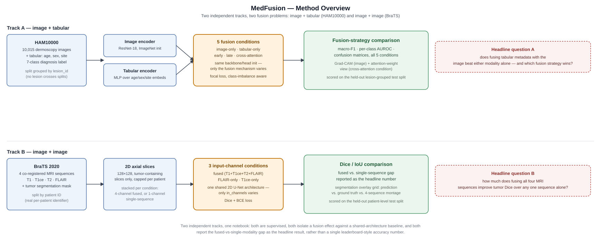
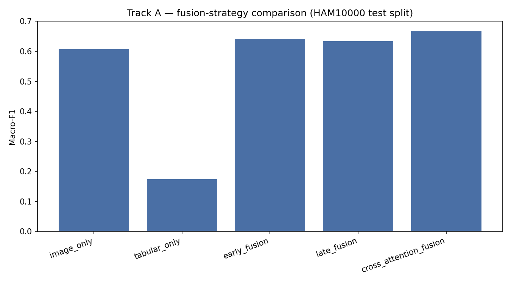
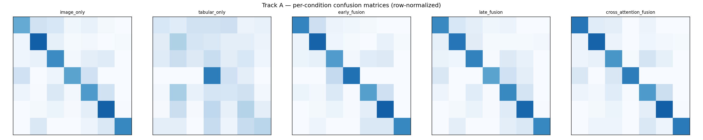
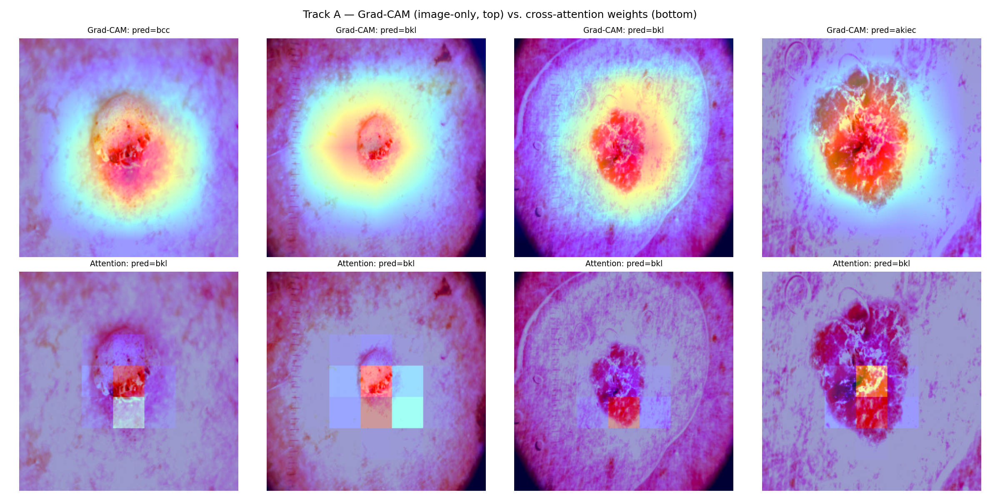
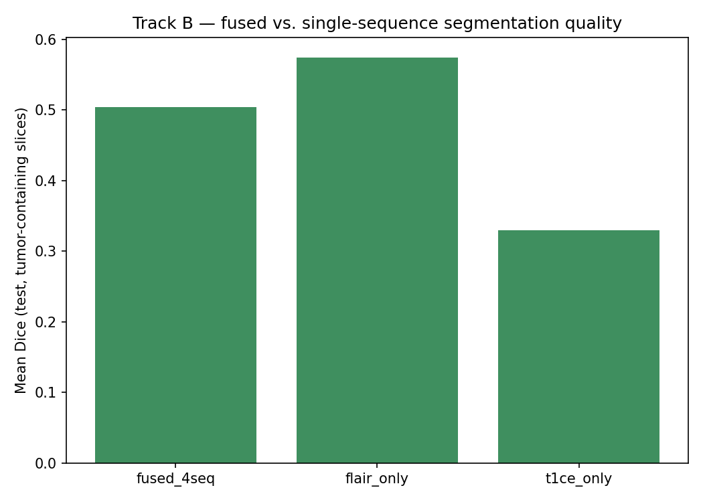
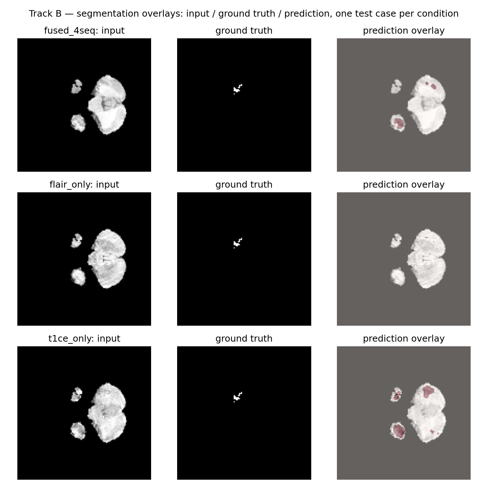

# MedFusion

### Does multimodal fusion actually improve medical AI?

[](...)
[](...)
[](...)
[](...)

MedFusion is a controlled study of multimodal fusion strategies across two structurally different medical-imaging problems:

- **Image + tabular:** dermoscopy images + patient metadata for skin-lesion classification.
- **Image + image:** multi-sequence MRI for brain-tumor segmentation.

The central question is whether the **fusion strategy itself** affects performance, and whether the benefits of multimodal learning generalize across fundamentally different modality pairings.

To isolate this effect, experiments within each track keep the backbone, initialization, training protocol, and evaluation split fixed while varying how modalities are combined.

---

## Research Question

Multimodal medical models are often evaluated using a single fusion architecture, making it difficult to determine whether observed improvements come from the additional modality, the fusion mechanism, or differences in the underlying training setup.

MedFusion instead treats **fusion strategy as the experimental variable**.

The study evaluates two complementary settings:

### Track A — Image + Tabular

HAM10000 dermoscopy images are combined with patient metadata:
age, sex, lesion site

Five conditions are compared:

1. Image-only
2. Tabular-only
3. Early fusion
4. Late fusion
5. Cross-attention fusion

### Track B — Image + Image

BraTS 2020 multi-sequence MRI is used for binary whole-tumor segmentation.

Three conditions are compared:

1. FLAIR-only
2. T1ce-only
3. Four-sequence fusion: T1 + T1ce + T2 + FLAIR

The two tracks deliberately represent different multimodal structures rather than variations of the same problem.




**Figure 1.** MedFusion consists of two independent experimental tracks. Track A compares five image/tabular conditions using HAM10000, while Track B compares three MRI sequence conditions using BraTS 2020. Within each track, the experimental setup is controlled so that the primary variable is the modality or fusion strategy.

---

## Experimental Design

### Track A — HAM10000

HAM10000 contains 10,015 dermoscopy images covering seven diagnostic categories.

A ResNet-18 image encoder pretrained on ImageNet and a small tabular MLP encoder are used.

The five experimental conditions are:

| Condition | Input | Fusion |
|---|---|---|
| Image-only | Image | None |
| Tabular-only | Age + sex + site | None |
| Early fusion | Image + tabular | Feature concatenation |
| Late fusion | Image + tabular | Learned logit weighting |
| Cross-attention | Image + tabular | Tabular-to-image spatial attention |

The image and tabular components share initialization across the relevant conditions. The image encoder uses a reduced learning rate relative to the newly initialized fusion components.

The dataset is split at the **lesion level** to prevent images belonging to the same lesion from appearing across train, validation, and test sets.

### Track B — BraTS 2020

BraTS 2020 provides four co-registered MRI sequences:

- T1
- T1ce
- T2
- FLAIR

A small 2D U-Net is trained for binary whole-tumor segmentation.

The three experimental conditions are:

| Condition | Input |
|---|---|
| FLAIR-only | FLAIR |
| T1ce-only | T1ce |
| Fused | T1 + T1ce + T2 + FLAIR |

The same U-Net architecture is used across conditions, with only the number of input channels changing.

Experiments use 128×128 axial slices and a 60-patient subset to remain feasible within a single Kaggle T4 session.

---

## Evaluation

### Track A — Classification

The following metrics are reported:

- Macro-F1
- Macro AUROC
- Per-class AUROC
- Row-normalized confusion matrix

Macro-F1 is particularly important because HAM10000 has substantial class imbalance.

### Track B — Segmentation

The following metrics are reported:

- Dice coefficient
- Intersection over Union (IoU)

Dice and IoU are averaged over tumor-containing test slices.

---

## Key Results

### Track A — HAM10000


| Condition | Macro-F1 | Macro AUROC |
|---|---:|---:|
| Image-only | 0.6080 | 0.9486 |
| Tabular-only | 0.1733 | 0.6837 |
| Early fusion | 0.6410 | 0.9488 |
| Late fusion | 0.6342 | **0.9553** |
| **Cross-attention fusion** | **0.6672** | 0.9473 |







Cross-attention achieved the highest macro-F1 among the evaluated conditions, improving from **0.6080 to 0.6672** relative to image-only classification.

Late fusion achieved the highest macro AUROC at **0.9553**.

This indicates that the benefit of multimodal fusion depends not only on whether an additional modality is available, but also on **how that modality is integrated and which evaluation metric is considered**.

---

### Track B — BraTS 2020

| Condition | Dice | IoU |
|---|---:|---:|
| Four-sequence fusion | 0.5043 | 0.4756 |
| **FLAIR-only** | **0.5740** | **0.5084** |
| T1ce-only | 0.3298 | 0.2791 |

In this experiment, four-sequence channel stacking underperformed FLAIR-only segmentation:

**Dice gap: −0.0697**

The fused model nevertheless substantially outperformed T1ce-only segmentation.

 

 

The result illustrates that **adding modalities does not automatically translate into better performance**. A more complex input representation can introduce additional optimization and generalization challenges, particularly when training data and model capacity are limited.

---

## Main Takeaway

The two tracks produce different outcomes:

> **Fusion helped in the image + tabular setting, but naive fusion did not help in the image + image setting.**

This suggests that multimodal learning should not be treated as a universally beneficial operation.

Its effectiveness may depend on:

- The structure of the modalities
- The fusion mechanism
- The task
- Dataset size
- Model capacity
- Regularization
- The strength and complementarity of the additional modality

The BraTS experiment specifically evaluates **simple channel stacking**, not sophisticated multimodal fusion architectures. Therefore, its result should not be interpreted as evidence that multi-sequence MRI fusion is inherently inferior to single-sequence models.

---

## Datasets

| Track | Dataset | Size | Task |
|---|---|---:|---|
| A | HAM10000 | 10,015 images | 7-class skin-lesion classification |
| B | BraTS 2020 | 369 patients | Binary whole-tumor segmentation |

### HAM10000

Dermoscopy images and associated metadata are used for Track A.

Dataset source: [HAM10000 — Kaggle](https://www.kaggle.com/datasets/kmader/skin-cancer-mnist-ham10000)

### BraTS 2020

Multi-sequence MRI and tumor annotations are used for Track B.

Dataset source: [BraTS 2020 — Kaggle](https://www.kaggle.com/datasets/awsaf49/brats20-dataset-training-validation)


---

## Model Configuration

| Track | Component | Configuration |
|---|---|---|
| A | Image encoder | ResNet-18, ImageNet-pretrained |
| A | Tabular encoder | MLP over age + embedded sex/site |
| A | Fusion | Early / late / cross-attention |
| B | Segmentation | 2D U-Net |
| B | Base channels | 32 |
| B | Depth | 4 |
| B | Input | 1 or 4 MRI sequences |
| B | Initialization | From scratch |

---
## Installation

```bash
git clone https://github.com/yasmina-benmabrouk/MedFusion.git
cd MedFusion

python -m venv .venv

# Linux / macOS
source .venv/bin/activate

# Windows
.venv\Scripts\activate

pip install -r requirements.txt
```


---

## Citation

If you use this repository in your research, please cite:

```bibtex
@software{medfusion2026,
  title  = {MedFusion: Multi-Modal Fusion Strategies Across Image+Tabular and Image+Image Medical Data},
  author = {Benmabrouk, Yasmina},
  year   = {2026},
  url    = {https://github.com/yasmina-benmabrouk/MedFusion}
}
```


---

## References

### Multimodal Fusion

- Yap, J., Yolland, W., Tschandl, P. (2018).  
  *Multimodal Skin Lesion Classification Using Deep Learning*.  
  Experimental Dermatology, 27(11), 1261–1267.  
  https://doi.org/10.1111/exd.13777

- Havaei, M., Guizard, N., Chapados, N., Bengio, Y. (2016).  
  *HeMIS: Hetero-Modal Image Segmentation*.  
  arXiv:1607.05194.

- Isensee, F., Kickingereder, P., Wick, W., Bendszus, M., Maier-Hein, K. H. (2018).  
  *No New-Net*.  
  arXiv:1809.10483.

### Foundational Methods

- Ronneberger, O., Fischer, P., Brox, T. (2015).  
  *U-Net: Convolutional Networks for Biomedical Image Segmentation*.  
  arXiv:1505.04597.

- Vaswani, A., et al. (2017).  
  *Attention Is All You Need*.  
  arXiv:1706.03762.

- Lin, T.-Y., Goyal, P., Girshick, R., He, K., Dollár, P. (2017).  
  *Focal Loss for Dense Object Detection*.  
  arXiv:1708.02002.

- Milletari, F., Navab, N., Ahmadi, S.-A. (2016).  
  *V-Net: Fully Convolutional Neural Networks for Volumetric Medical Image Segmentation*.  
  arXiv:1607.04797.

- Isensee, F., Jaeger, P. F., Kohl, S. A. A., Petersen, J., Maier-Hein, K. H. (2021).  
  *nnU-Net: A Self-Configuring Method for Deep Learning-Based Biomedical Image Segmentation*.  
  Nature Methods, 18, 203–211.

### Datasets

- Tschandl, P., Rosendahl, C., Kittler, H. (2018).  
  *The HAM10000 Dataset*.  
  Scientific Data, 5, 180161.  
  https://doi.org/10.1038/sdata.2018.161

- Menze, B. H., et al. (2015).  
  *The Multimodal Brain Tumor Image Segmentation Benchmark (BRATS)*.  
  IEEE Transactions on Medical Imaging, 34(10), 1993–2024.

- Bakas, S., et al. (2018).  
  *Identifying the Best Machine Learning Algorithms for Brain Tumor Segmentation, Progression Assessment, and Overall Survival Prediction in the BRATS Challenge*.  
  arXiv:1811.02629.

---
